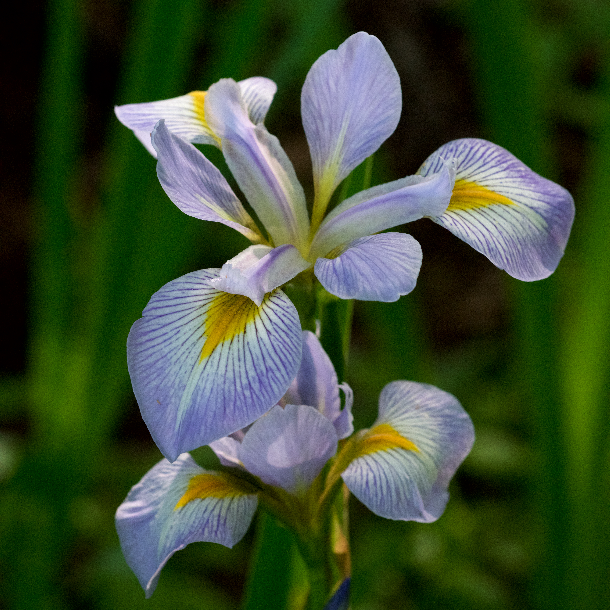
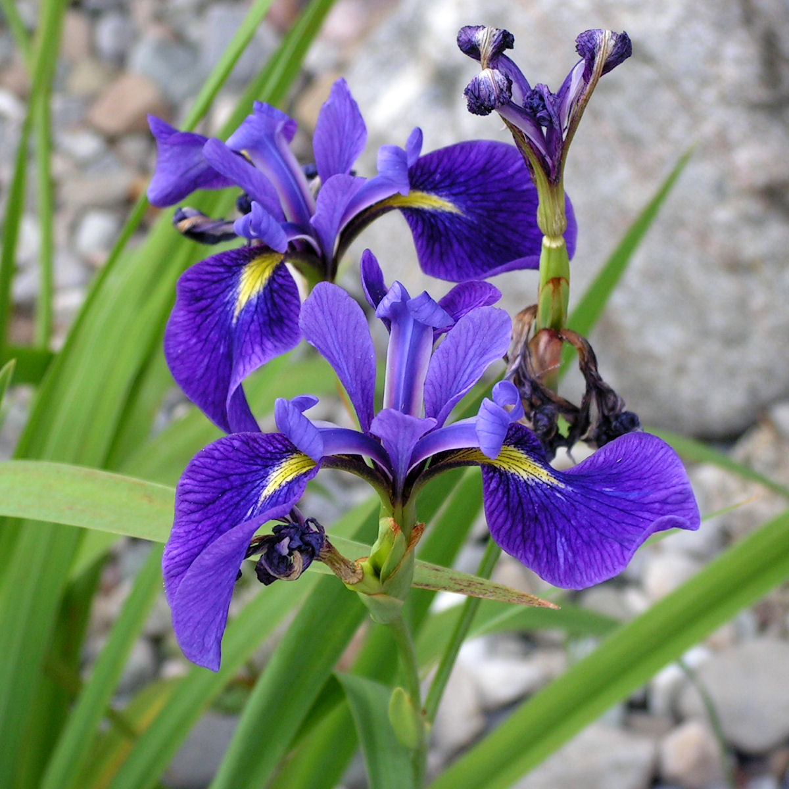
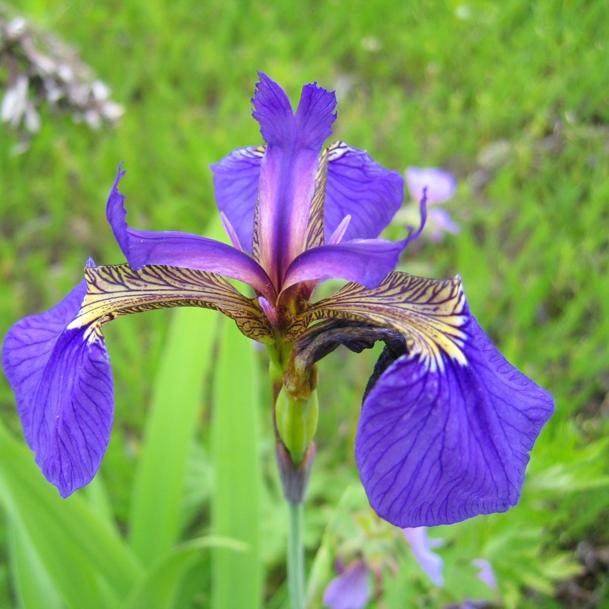

## The Iris dataset

This data was made infamous by @fisherUSEMULTIPLEMEASUREMENTS1936. <br>

{width="300" fig-align="center"}

## The data

```{r}
#| label: tbl-one
#| tbl-cap: Summary of some of the iris data
#| echo: false

library(viridis)
library(tidyverse)
library(dplyr)
library(DT)
library(ggplot2)
library(plotly)
data <- iris

table <- iris |>
  group_by(Species) |>
  summarise(Petal.Length_M = mean(Petal.Length),
            Petal.Length_SD = sd(Petal.Length))

datatable(table, options = list(pageLength = 3),
          width = 500, height = 300)
```

## Length and width

Let's see the relation between petal length and width for the three species

```{r}
#| label: fig-one
#| fig-cap: Petal length and width of the 3 species
#| echo: false

plot <- ggplot(data, mapping = aes(Petal.Width, Petal.Length,
                                   colour = Species)) +
  geom_point() +
  geom_smooth(se = FALSE, method = lm) +
  scale_colour_manual(values = c("setosa" = "powderblue",
                                 "versicolor" = "thistle3",
                                 "virginica" = "pink")) +
  theme_dark() +
  labs(x = "Width", y = "Length", colour = "Species")

ggplotly(plot)
```

## Versicolor vs setosa

Let's take a closer look at versicolor and setosa irises, how much of a difference can we see in petal length?

::::: columns
::: {.column width="50%"}
<center>

{width="300" fig-align="center"}

</center>
:::

::: {.column width="50%"}
<center>

{width="300" fig-align="center"}

</center>
:::
:::::

## Weighted Cohen's D

To be sure, and without relying on our eyesight, we can calculate the Cohen's D. This is a metric that expresses the size of the difference between two group means. The formula for Cohen's D is:

\begin{align}

D &= \frac{\bar{X_1} \: - \bar{X_2}}{SD_{pooled}} \\
  &= \frac{\bar{X_1} \: - \bar{X_2}}{\sqrt{(SD_1^2 \: + 
    SD_2^2)/2}}
    
\end{align}

## Calculating Cohen's D

Cohen's D for petal length in versicolor and setosa irises is:

```{r}
#| echo: false
#| cache: true
#| label: cohensd

# taking both sds and means (we will square sds and obtain variances)
versicolor <- data |>
  filter(Species == "versicolor")
setosa <- data |>
  filter(Species == "setosa")

# take means and sd's
v_mean <- mean(versicolor$Petal.Length)
s_mean <- mean(setosa$Petal.Length)
v_sd <- sd(versicolor$Petal.Length)
s_sd <- sd(setosa$Petal.Length)

# calculating Cohens D
mean_diff <- v_mean - s_mean
pooled_sd <- sqrt((v_sd^2 + s_sd^2)/2)
cohensd <- mean_diff/pooled_sd
cohensd
```

which is very large. This was to be expected, based on what we saw in @tbl-one: large differences in means and smalls SD's.

## Calculating Cohen's D in R

``` r
# we split the groups first, so we have a dataframe for both species
versicolor <- data |>
  filter(Species == "versicolor")
setosa <- data |>
  filter(Species == "setosa")

# take means and sd's for both species
v_mean <- mean(versicolor$Petal.Length)
s_mean <- mean(setosa$Petal.Length)
v_sd <- sd(versicolor$Petal.Length)
s_sd <- sd(setosa$Petal.Length)

# and we calculate Cohens D
mean_diff <- v_mean - s_mean
pooled_sd <- sqrt((v_sd^2 + s_sd^2)/2)
cohensd <- mean_diff/pooled_sd
cohensd
```

## Citation/reference list

::: {#refs}
:::

Make sure we have a reproducible environment (renv)
